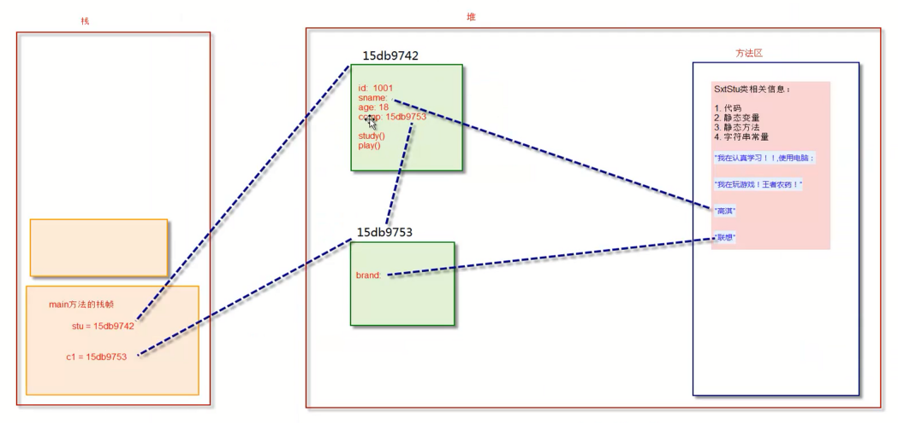

# 二、面向对象基础

### 1. 内存分析

#### 1.1 Java虚拟机的内存

​	Java虚拟机的内存可以分为三个区域：**栈Stack、堆Heap、方法区method area（也是在堆中）**。

##### 1.1.1 栈的特点：

- 栈是方法执行的内存模型，每个方法被调用后都会创建一个栈帧，栈帧会保存该方法的局部变量、操作数、方法出口等；
- JVM会为每个线程都开辟一个栈，用于存放该线程执行方法的信息（实际参数、局部变量等），因此，栈时线程私有的，不能线程之间不能共享栈内的数据；
- 栈由系统自动分配，速度快，属于连续的内存空间；

##### 1.1.2 堆的特点：

​	堆是一个不连续的内存空间，分配灵活，速度慢。JVM中只有一个堆，用所有线程之间都共享这个空间。堆用于存储创建好的对象和数组（数组也是对象）。

##### 1.1.3 方法区的特点：

- JVM中只有一个方法区，被所有的线程共享；
- 方法区位于堆中，用于存储类和常量相关的系想你（例如：**类信息Class对象**、**静态变量**、**字符串常量等**）；

##### 1.1.4 模型分析

### 2. 垃圾回收机制

​	Java中的垃圾回收机制中需要做到两点：

1. 发现内存中无用的对象
2. 清除无用的对象；

其中，发现的方法主要由两种：① 引用计数法； ② 引用可达法（根搜索法）。

### 3. 通用分代垃圾回收机制

​	了解分代垃圾回收机制

### #. 易遗忘知识点

- 静态代码块是用来初始化类对象的；静态代码块的执行顺序根据它所处的位置来决定（按照声明的顺序来执行）。
- `instanceof`是一个二元运算符，可以用来测试一个对象是否为一个类的实例，当是该类的实例时，会返回`true`。（注意：当`实例 instanceof 实例对应的类的父类`时，返回的也是`true`.）
- `==` 和`equals()`方法：
  - `==`代表比较双方是否相同，如果是基本类型则表示判断值是否相等，如果是引用类型，则表示地址是否相等。

# 三、多线程

### 3.1 创建线程的方式

#### 3.1.2 利用`Callable`接口创建多线程

**步骤**：

1. 创建目标对象；
   ``
2. 创建执行任务；
   `ExecutorService ser = Executors.newFixedThreadPool(1);`
3. 提交执行；
   `Future<Boolean> result1 = ser.submit(目标对象);`
4. 获取结果；
   `boolean r1 = result1.get();`
5. 关闭服务；
   `ser.shutdownNow();`

### #. 易遗忘的知识点

1. Java中多线程用了**静态代理模式**，具体模式就是：
   - 定义两个角色：目标角色`You`和代理角色`WeddingCompany`；
   - 上面的两个角色实现相同的接口`Marry`；
   - 每个角色都继承`Marry`接口，并实现对应的方法：
     - 针对`You`：根据具体的业务来写；
     - 针对`WeddingCompany`：保存一个目标对象，并调用目标对象的实现方法；同时，在调用方法之前可以执行一些操作（**例如记录日志**），在调用方法之后也可以执行一些操作（**例如记录日志**）。

<a href="./README.md">点击进入ReadMe.md</a>